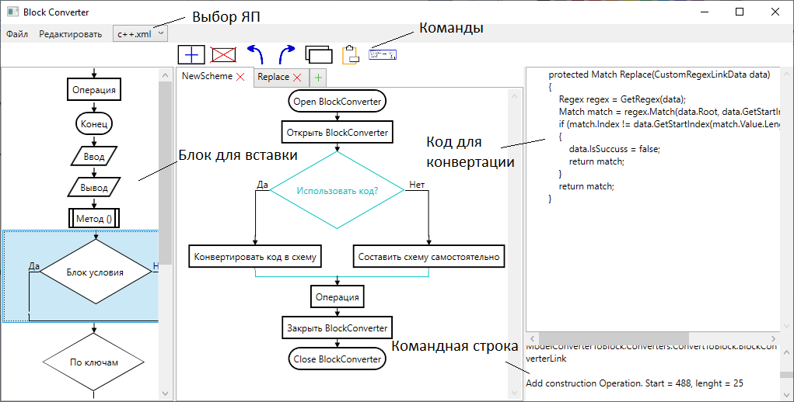

<h1>Обзор</h1>

BlockConverter - программа для конвертации кода в блок-схемы.

<h1>Инструция для пользования</h1>
</img>
</img>

Дизайн программы интуитивно понятен. Если несколько не очевидных моментов:

1) Для изменения текста блока необходимо кликнуть по нему ЛКМ два раза.

2) При выделении блок подсвечивается. Если необходимо вставить блок в ветвь другого блока, то нужно кликнуть по названию ветви.

3) Существуют горячие клавиши для вставки блоков. Они отображаются при наведении на блоки слева в качестве подсказок.

4) В меню Setting можно выбрать дизайн блоков и преобразования строк при конвертации. Об этом немного по-подробнее:

</img>

На вход поступают массив некоторых значений. Есть ноды, который этот массив преобразуют в строковое представление, которое записвается в качестве контента блока.

<h1>Используемые библиотеки</h1>
<a href="https://www.nuget.org/packages/Microsoft.Xaml.Behaviors.Wpf/1.1.39?_src=template">Microsoft.Xaml.Behaviors.Wpf</a>
<a href="https://www.nuget.org/packages/Newtonsoft.Json/13.0.1?_src=template">Newtonsoft.Json</a>
<h1>Инструкции</h1>
<a href="ModelConverterToBlock/AddLanguageInstruction.md">Добавление своего ЯП</a>
<a href="ModelConverterToBlock/AddonsInstruction.md">Добавление нового блока или шаблона (звена цепочки)</a>